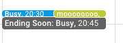
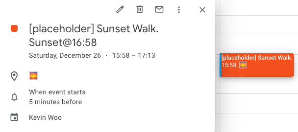

# Calendar Tools
This repo contains a series of calendar tools that have helped manage my calendar.

<!-- ./gh-md-toc --insert README.md -->
<!--ts-->
   * [Calendar Tools](#calendar-tools)
      * [createEndingSoonEvents](#createendingsoonevents)
      * [blockWorkCalWithPersonEventPlaceholders](#blockworkcalwithpersoneventplaceholders)
      * [createWalkEvent](#createwalkevent)
      * [cleanup](#cleanup)
   * [Setup](#setup)

<!-- Added by: kevinwoo, at: Wed Dec 23 23:29:39 PST 2020 -->

<!--te-->


## createEndingSoonEvents
This is useful to get a notification that a calendar event is ending soon.

> Example: this created a `Ending Soon: Busy` at `20:45pm - 20:45pm` for the `Busy` event from `20:30pm - 20:45pm`
> 
> <kbd></kbd>


It works by looking at your work calendar, then creating a `Ending Soon: XXXX` event at the ending time of your event on a 2nd calendar. These are one off events, each subsequent event will have its own.
 
Setup:
- You'll need to create a calendar, I called mines `ending-soon-cal`, and provide the calendar ID in the configurations. 
- Don't forget to set up the reminders!
- I have a calendar default reminder to go off at 5m and 0m prior to the event.


## blockWorkCalWithPersonEventPlaceholders
Double Booked all the time because of a personal event that didn't show up on your work calendar?? 
It's a pain to share a personal event with your work calendar for each event. 
It's also a pain to manually block out time on your work calendar for those events.

This script will look at your personal calendar, and create `Busy` events on your work calendar at the same time as your personal event. 

> Example: this created a `Busy` event for my personal event `moooooooo`
>
> <kbd></kbd>

These are private events so no one calendar stalking you can see the title/details, to take it one step further, the placeholder event's title is just `Busy` (configurable). 

The only identifying information is the `eventID`, which I believe is randomly generated when creating a Calendar Event. 
I don't believe this leaks any information unless your calendar is shared or public. At that point, someone maybe able to find the event. Buuuut... your calendar is already public 🤔, so 🤷‍♂️. 


## createWalkEvent
This will create "sunset walk events" that will get generated depending on your provided longitude and latitude. I use this to remind myself to go take a walk during the [Golden Hour](https://en.wikipedia.org/wiki/Golden_hour_(photography)).

> Example event: this created a `[placeholder] Sunset Walk @16:58`, starting 1 hour before sunset and ending 30m after sunset
>
> <kbd></kbd>


## cleanup
Is a helper script to remove all events on a calendar. Use with caution!

It's useful to blast away the events created by the `createEndingSoonEvents` or `createWalkEvent`


# Setup

1. Create a file `src/config.ts` that contains
    ```ts
    export const Config = {
      BlockWorkCalWithPersonEventPlaceholders: {
        WorkCalID: 'workEmail@work.com',
        PersonalCalID: 'personalEmail@gmail.com',
        WorkEventPlaceholderTitle: 'Busy'
      },
      EndingSoonEvents: {
        PrimaryCalID: 'workEmail@work.com', // id of the primary calendar to pull events from
        EndNotifCalID: 'domain_CalID@group.calendar.google.com', // id of the secondary calendar to push to
        LookAheadDays: 1 // days to look ahead and create events for
      },
      SunsetWalkEvents: {
        DaysToCreate: 14,
        Longitude: 0.00, // your longitude
        Latitude: 0.00 // your latitude
      }
    };
    ```

1. Install the packages
    ```bash
    yarn
    ```

1. Setup a Google App Script
    - Go to https://script.google.com/ and create a new `Project`.
    - From the URL, grab the id, it'll look something like `https://script.google.com/home/projects/{YOUR_SCRIPT_ID_IS_HERE}/edit`.
      - Another way to get it is to go to the `⚙️ Project Settings` page and you can find your Script ID.
    - Add this to `.clasp.json`
       ```json
      {
        "scriptId": "YOUR_SCRIPT_ID_IS_HERE",
        "rootDir": "dist"
      }
      ```
  
1. Push it to Google Scripts
    ```bash
    yarn build && clasp push -f
    ```

1. Setup a project trigger
    I setup a time based trigger on the 
    - `sync` function: every `30 minutes`
    - `createWalkEvent` function: `weekly every Monday 9-10am`
